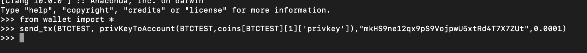
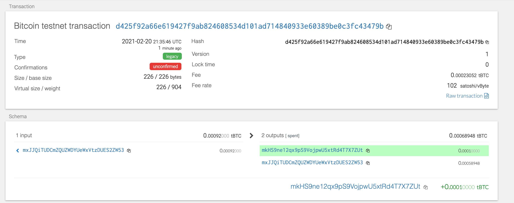
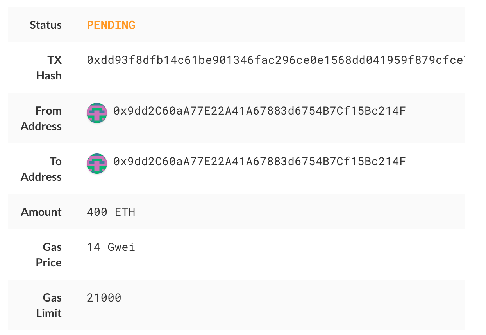
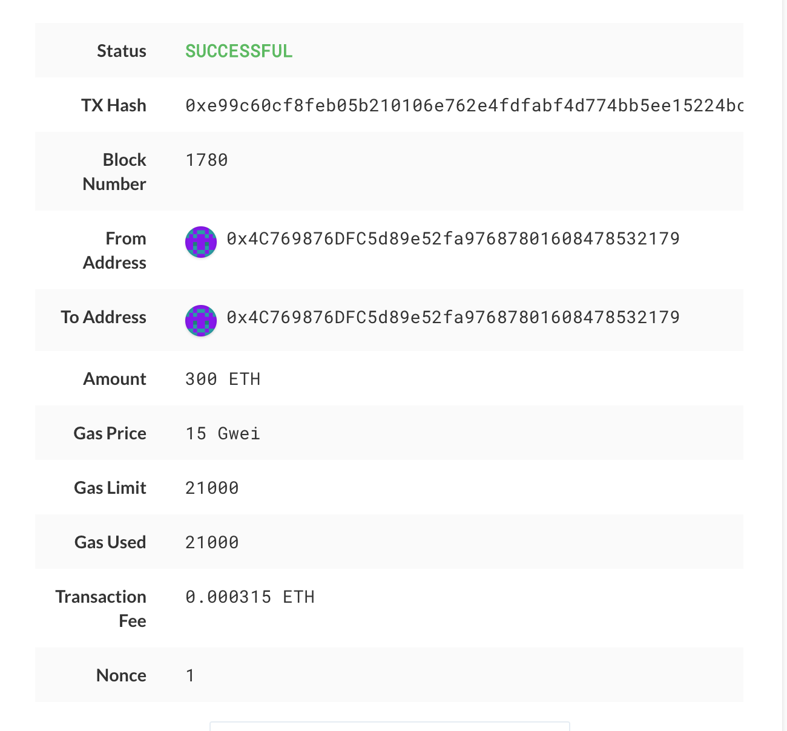

# Blockchain With Python 

## Wallet Overview

A wallet is a software that manages keys as well as allows you to send and sign transactions.  This wallet supports BIP44 and non-standard derivation paths for the most popular wallets out there. Using Python coding language, this wallet is a one-stop-shop for Bitcoin and Ethereum transactions. It allows the user to to use the same master key across multiple blockchains, as well as integrating a universal key manager tool with python libraries (Web3.py and Bit). 

## General Dependencies 
To use the wallet created, you need to install(specified in requirements.txt):
1) python packages (bit and web3)

2) HD Wallet Derive

3) Local Blockchain to connect to for ETH transacting 

4) MyCrypto Wallet 

#### Sample code to send transaction and use wallet 

- An ETH account has been prefunded with ETH Testnet using local nodes  
- A BTC account has been prefunded with BTC Testnet using a BTCTest Faucet 

You need coin type (ETH or BTCTEST) , account - call a function for converting derived private key to WIF object, recipient address and amount.  

`send_tx(BTCTEST,privKeyToAccount(BTCTEST), coins[BTCTEST][1]['privkey']), "4C769876DFC5d89e52fa97687801608478532179", 0.0001)`

## Wallet Transactions 

### BTCTEST 

`send_tx(BTCTEST,privKeyToAccount(BTCTEST), coins[BTCTEST][1]['privkey']), "4C769876DFC5d89e52fa97687801608478532179", 0.0001)`

### ETH 

`send_tx(ETH,privKeyToAccount(ETH), coins[ETH][0]['privkey']), "9dd2C60aA77E22A41A67883d6754B7Cf15Bc214F", 400)`

